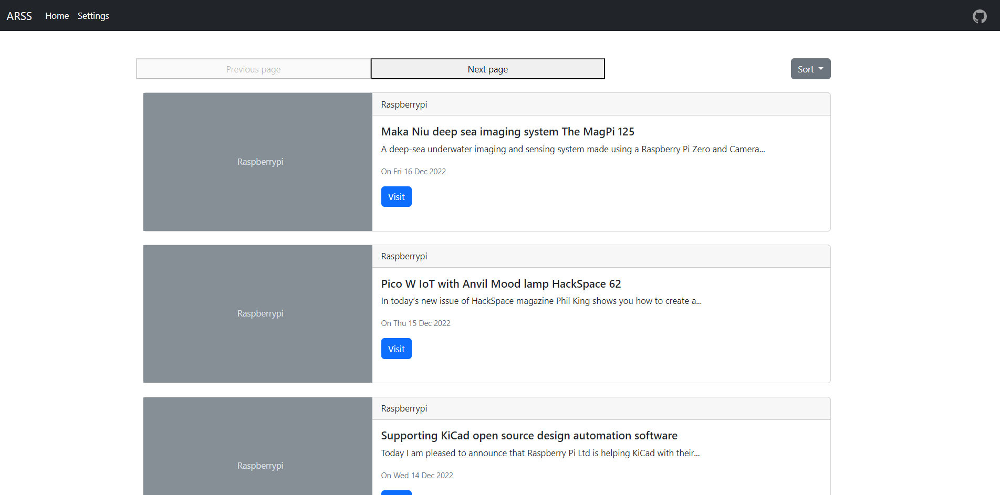

# Feedler
  


Feedler is a web application that allows users to easily fetch RSS feeds from various sources and stay up-to-date with their favorite websites and blogs. With a user-friendly interface, users can easily search for and add new feeds to their personalized list, view the latest updates, and save articles for later reading. Whether you're a news junkie, tech enthusiast, or simply looking for a way to stay informed, Feedler makes it easy to get the content you care about delivered right to your fingertips.



- [Feedler](#feedler)
    - [Installation](#installation)
    - [Run](#run)
      - [Method 1](#method-1)
      - [Method 2](#method-2)
      - [Run web server](#run-web-server)
    - [Usage](#usage)
    - [Warnings](#warnings)
    - [TODO](#todo)


### Installation
1. git clone https://github.com/vedantjain8/feedler.git
2. cd feedler
3. Edit Userdata.yaml to add site for rss fetching

### Run
#### Method 1
```python
python3 -m main.py
```
> This will fetch rss details from all sites listed in Userdata.yaml

#### Method 2
```python
python3 -m main.py -k <key from Userdata.yaml>
```
> This will fetch rss details for the given site

#### Run web server
```python
python3 -m flask_main.py
```
> This will start flask webserver on port 5000
> Visit http://ip:5000/fetch_data this will fetch rss data in background

### Usage
usage: main.py [-h] [-k KEY]

options:
| Key               | Message                         |
| ----------------- | ------------------------------- |
| -h, --help        | Show this help message and exit |
| -k KEY, --Key KEY | Key from Userdata.yaml          |

### Warnings
1. Some sites might not work
2. It might take a long time if there are many sites

### TODO
- [x] Add unique searching for onyl one site
- [x] Sqlite database to webapp i.e. frontend
- [x] Sort post on latest and oldest
- [x] Lazy loading
- [x] Run webserver while running main.py
- [x] pagination button setup
- [ ] sort by oldest post is giving me trouble
- [ ] Add parralel searching
- [ ] Add exception for everything
- [ ] Notification
- [ ] Site Name, Maybe you could suggest me somename 